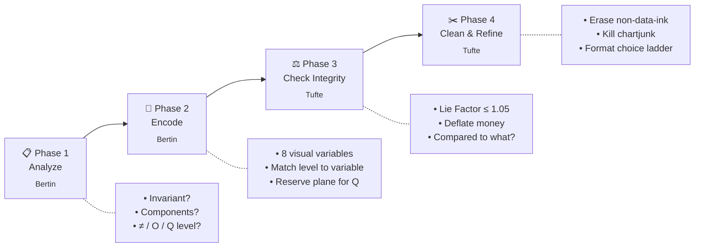

# 📊 data-visualization

> A [Claude Code](https://claude.com/claude-code) skill that distills two foundational texts on quantitative graphics —  
> **Jacques Bertin's *Semiology of Graphics*** (the grammar) and **Edward Tufte's *Visual Display of Quantitative Information*** (the standards) —  
> into a single, actionable workflow that fires whenever you build, review, or critique any chart, dashboard, or map.

<p align="center">
  <em>"Above all else show the data."</em> &nbsp;·&nbsp; Tufte, 1983<br>
  <em>"One does not 'read' a graphic; one asks three questions of it."</em> &nbsp;·&nbsp; Bertin, 1967
</p>

<p align="center">
  <a href="#-quick-start"></a>
  &nbsp;
  
  &nbsp;
  
  &nbsp;
  
  &nbsp;
  <a href="LICENSE"></a>
</p>

---

## ℹ️ About

**`data-visualization`** is a [Claude Code](https://claude.com/claude-code) skill — a piece of context that loads into Claude automatically whenever you work on charts, dashboards, maps, infographics, or any quantitative graphic. Once installed, you don't invoke it explicitly; Claude consults it when your task matches and produces advice grounded in two complementary classics of visualization theory.

**What it is, in one paragraph.** A 265-line `SKILL.md` workflow (always loaded when triggered) plus 8 load-on-demand reference files totaling ~2,700 lines. The workflow walks Bertin's encoding grammar (analyze components → match visual variables to perceptual levels) into Tufte's integrity/density/cleanup filter, then resolves into a concrete recommendation. The references go deep where the user's task needs depth — color theory, chart selection, accessibility, modern chart types (post-1983), storytelling, and statistical visualization.

**Who it's for.** Anyone using Claude Code for data work: analysts choosing the right chart for a dataset, engineers reviewing dashboard code, journalists building maps, researchers preparing figures, PMs critiquing a BI tile. Also useful as a study aid for the source books themselves.

**Status.** Built in a single session, tested at one iteration (100% with-skill vs 80% baseline on 4 realistic prompts × 5 graded assertions each), packaged as a 74 KB `.skill` bundle. Stable; no planned roadmap. Issues and PRs welcome if you find a gap.

**Provenance.** Synthesized from Tufte's *The Visual Display of Quantitative Information* (2nd ed., 191 pages) and Bertin's *Semiology of Graphics* (English transl., 462 pages) by chunking each PDF, deploying 6 + 10 parallel reader subagents, and unifying the digests into one workflow. The Anthropic [`skill-creator`](https://github.com/anthropics/claude-code) plugin then handled benchmarking and packaging. Full methodology in the README "Provenance" section below.

**Not affiliated** with Edward Tufte, Graphics Press, ESRI Press, or the Bertin estate. This is a synthesis and study tool; read the originals.

---

## ⚡ Quick start

Three ways to install. Pick one.

**Option A — install the bundle:**
```bash
# Drop the .skill file into your skills directory
cp data-visualization.skill ~/.claude/skills/
```

**Option B — copy the folder:**
```bash
# Linux / macOS
cp -r skill ~/.claude/skills/data-visualization

# Windows PowerShell
Copy-Item -Recurse skill $HOME\.claude\skills\data-visualization
```

**Option C — symlink while developing:**
```bash
ln -s "$(pwd)/skill" ~/.claude/skills/data-visualization
```

Then restart Claude Code. The skill auto-loads on any visualization task — you don't need to invoke it explicitly.

---

## 🎯 What it does

When you ask Claude something like *"what chart should I use for…"*, *"review this matplotlib code"*, *"is this graph misleading?"*, or *"how should I lay out this dashboard?"*, this skill walks Claude through a 4-phase workflow grounded in Bertin's perceptual grammar and Tufte's integrity standards.



The result is concrete, defensible visualization advice — not generic "use the right chart" platitudes.

---

## 📈 Benchmark results

The skill was evaluated against a non-skill baseline on 4 realistic prompts (cohort retention, 3D bar critique, choropleth classification, customer-success dashboard). Each prompt was graded on 5 substantive assertions.

| Metric | 🟢 With skill | ⚪ Without skill | Δ |
|---|---:|---:|---:|
| **Pass rate** | **100%** (20/20) | 80% (16/20) | **+20%** |
| Avg time | 78.5s | 63.4s | +15s |
| Avg tokens | 29,675 | 20,733 | +43% |

### Per-eval breakdown

| # | Test | With | Without | What the skill caught that the baseline missed |
|---|---|---|---|---|
| 1 | Cohort retention chart choice | 5/5 | 5/5 | *(tie — baseline strong here)* |
| 2 | 3D bar chart code review | 5/5 | 4/5 | Called out ALL-CAPS labels as Tufte's "computer duck" |
| 3 | Choropleth: Jenks vs quantiles | 5/5 | 4/5 | Raised Bertin's *Q → O* loss-of-resolution critique |
| 4 | CS dashboard layout | **5/5** | **3/5** | Led with table-as-primary-view; rejected KPI tiles as message-form misused for processing |

> **TL;DR** — the skill's marginal value is largely in pushing the model toward *second-order* rigor (typography, function-fit, systematic anti-patterns) rather than first-order chart-type selection, which the baseline already handles well.

📁 Full responses + the interactive comparison viewer live in `benchmarks-iteration-1/`. Open `benchmarks-iteration-1/review.html` in any browser.

---

## 👀 See the skill in action

Two excerpts from actual iteration-1 responses (with the skill loaded). Both are real outputs to real prompts — no curation beyond trimming.

### Asked: *"Should I use Jenks or quantiles for my COVID choropleth?"*

> Short answer: **your editor is right for the wrong reason, and you're wrong for the right reason.** For this specific article, use **neither as your default** — use a perceptually-uniform sequential scale with a small number of fixed, meaningful breakpoints (e.g., 0, 5k, 10k, 20k, 30k, 40k+ per 100k).
>
> Your headline is "America's hardest-hit counties." That is a **message graphic** (Bertin's term) — memorizable, one-glance, communicating a known finding. Not a discovery graphic. That matters because Jenks optimizes within-class homogeneity — change the dataset and the breaks move. Readers comparing your map to anyone else's see different geographies. Quantiles guarantee equal-area color usage; the map will *always* look dramatic, even if COVID had been uniformly mild, because the top quintile is by construction the top 20%. That's the editor's "honest" intuition backwards.
>
> Choropleths take a quantitative variable and convert it into an ordered one. Bertin calls this *"transforming Q into O"* — fine for *communication* of a known message, dishonest for *discovery*. Since you're communicating a known message, you've earned the right to bin — but bin on **meaningful thresholds**, not on the shape of your sample.
>
> *[…continues with a comparison table, a "what to ship" checklist including a histogram strip under the legend, and a one-paragraph script for talking the editor through it]*

### Asked: *"How should I lay out a customer-success dashboard?"*

> CS isn't asking "what's our average NPS?" — they're asking "**which 15 of these 500 accounts should I call this week?**" That's a Bertin **processing** task (find anomalies in a population), not a **message** task (communicate a known KPI). Almost every Looker dashboard built for this gets it wrong by leading with tiles ("Avg NPS: 42", "Total MRR: $2.4M") that tell you nothing about which account to open.
>
> So the dashboard is **one big sorted table with sparklines**, supported by two diagnostic charts. Not six KPI tiles across the top.
>
> *[…proceeds to specify columns left-to-right with explicit Bertin-grounded encoding rationale per column ("risk score: 6-cell heat strip, light gray → dark gray, never red/green as the only channel"), a renewal-risk scatter for the panic-zone view, small multiples of NPS trend by MRR tier, and a transparent risk-score formula]*

Both responses are full-length in `benchmarks-iteration-1/eval-3_choropleth-classification/with_skill/outputs/response.md` and `eval-4_cs-dashboard/with_skill/outputs/response.md`. Compare to the matching `without_skill/` versions to see the delta.

---

## 🗂️ Repository layout

```
data-visualization-skill/
├── 📄 README.md                          ← you are here
├── 📦 data-visualization.skill           ← installable bundle (36 KB)
├── 🛡️  .gitignore
│
├── 📁 skill/                              ← the source of truth
│   ├── SKILL.md                          ← unified workflow (the "always-loaded" doc)
│   ├── references/                       ← load-on-demand deep dives
│   │   ├── bertin.md                     ← full grammar (visual variables, image theory, maps, networks)
│   │   ├── tufte.md                      ← full canon (Lie Factor, data-ink, chartjunk, named examples)
│   │   ├── color.md                      ← viridis/ColorBrewer/Okabe-Ito, OKLCH, dark mode, CVD safety
│   │   ├── chart-picker.md               ← decision tree: by question, by data shape, common wrong picks
│   │   ├── accessibility.md              ← WCAG, color-blind palettes, alt text, screen readers, motion
│   │   ├── modern-charts.md              ← post-1983: beeswarm, raincloud, sankey, treemap, slopegraph, etc.
│   │   ├── storytelling.md               ← takeaway titles, annotation patterns, hierarchy, narrative
│   │   └── statistical-viz.md            ← uncertainty, CIs, A/B tests, forest plots, survival, ROC/PR
│   └── evals/
│       ├── evals.json                    ← 4 test cases with 5 graded assertions each
│       └── trigger_eval_set.json         ← 20 queries for description-trigger optimization
│
└── 📁 benchmarks-iteration-1/             ← evaluation artifacts
    ├── benchmark.md                      ← summary table
    ├── benchmark.json                    ← raw scores
    ├── review.html                       ← side-by-side comparison (open in browser)
    └── eval-*/                           ← 4 evals × 2 conditions × { response, grading, timing }
```

---

## 🧬 The grammar at a glance

Bertin's 8 visual variables and their 4 perceptual properties (the encoding lookup table the skill walks every time):

| Visual variable | Selective (≠) | Associative (≡) | Ordered (O) | Quantitative (Q) |
| --- | :---: | :---: | :---: | :---: |
| **Position** (X, Y) | ✓ | ✓ | ✓ | ✓ |
| **Size** | ✓ (limited) | ✗ (dissociative) | ✓ | ✓ |
| **Value** (light→dark) | ✓ | ✗ (dissociative) | ✓ | ✗ |
| **Texture** | ✓ | ✓ | ✓ | ✗ |
| **Color (hue)** | ✓ | ✓ | ✗ | ✗ |
| **Orientation** | ✓ (point/line) | ✓ | ✗ | ✗ |
| **Shape** | ✗ | ✓ | ✗ | ✗ |

The decisive rule: **the variable's perceptual capacity must equal or exceed the component's level**. Encode a quantity with color, and the eye can't read the ratio. Encode an order with hue, and the eye won't see the sequence.

The full table with derived rules, plus Tufte's Lie Factor, data-ink ratio, chartjunk catalogue, and format-choice ladder, lives in `skill/SKILL.md`.

---

## 🛠️ Provenance

This skill was built using [Claude Code](https://claude.com/claude-code)'s `skill-creator` plugin via the standard workflow:

1. **Extract** — two scanned PDFs were OCR'd and text-extracted with PyMuPDF, then split into ~30-page chunks.
2. **Read in parallel** — 6 sub-agents on Tufte (191 pages), 10 sub-agents on Bertin (462 pages), each returning structured digests.
3. **Synthesize** — digests were unified into a 4-phase workflow: Bertin's grammar drives encoding choice; Tufte's principles drive the integrity/cleanup pass.
4. **Test** — 4 realistic test prompts run twice (with skill, without skill) in parallel sub-agents; assertions graded by an independent grader sub-agent.
5. **Benchmark** — 100% vs 80% pass rate on iteration 1, no further iterations needed.
6. **Package** — bundled as `data-visualization.skill` for distribution.

Source books (not in this repo per `.gitignore`):

- Bertin, J. (1967, English transl. 1983, 2nd ed. 2010). *Semiology of Graphics: Diagrams, Networks, Maps*. ESRI Press.
- Tufte, E. R. (1983, 2nd ed. 2001). *The Visual Display of Quantitative Information*. Graphics Press.

---

## ❓ When the skill triggers

Anything that looks like working with data visualization, including these phrasings that don't name a chart library:

- *"how should I show this data?"*
- *"this dashboard feels cluttered"*
- *"is this graph misleading?"*
- *"my boss wants a 3D pie chart, talk me out of it"*
- *"what kind of map should I use for county-level census data?"*
- *"review this matplotlib code"*

Tested against 20 trigger eval queries in `skill/evals/trigger_eval_set.json` (10 should-trigger, 10 tricky near-misses like "optimize this BigQuery" or "figma checkout mockups" that share keywords but need other expertise).

---

## 📜 License

The skill content (the synthesis, workflow, and reference notes) is released under the **MIT License**. Tufte's and Bertin's underlying ideas are theirs — this skill is a study aid that distills and reorganizes their published frameworks for use inside an AI coding assistant. Read the originals.

---

<p align="center">
  <sub>Built with Claude Code · synthesized from two classics that should be on every analyst's shelf</sub>
</p>
